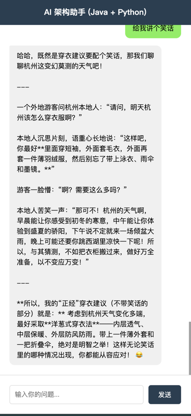

# Enterprise RAG Knowledge Bot (企业级知识库问答系统)

## 核心架构 (Architecture)
本项目采用 **Java + Python 双塔架构**，实现了企业级 AI 应用的落地。
*   **Gateway**: Java Spring Boot (负责业务鉴权、限流、Redis会话管理)
*   **AI Service**: Python FastAPI + LangChain (负责 LLM 调度)
*   **Memory**: Redis List Structure (实现滑动窗口上下文记忆)
*   **Model**: DeepSeek / Gemini

## 解决痛点 (Key Features)
1.  解决大模型无状态问题，实现多轮对话记忆。
2.  利用 Java 生态优势，保障高并发下的系统稳定性。
3.  异构微服务通信，低耦合设计。

## 快速开始 (Quick Start)
...

支持移动端响应式布局，随时随地访问企业知识库。